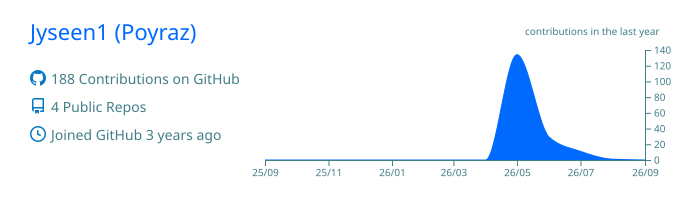
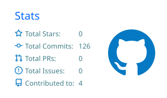
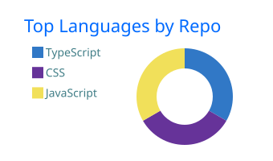
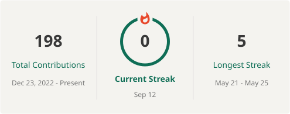

<p align="center">
  
</p>

<p align="center">
  <strong>Product-minded developer building ambitious digital experiences.</strong><br/>
  From operational platforms to cinematic interfaces and game systems.
</p>

<p align="center">
  <a href="https://github.com/Jyseen1?tab=repositories">
    
  </a>
  <a href="mailto:poyraztufekcier41@gmail.com">
    
  </a>
  
</p>

---

## About me

```ts
const poyraz = {
  role: "Product-minded developer",
  focus: ["Product Engineering", "AI Systems", "Interactive Experiences"],
  currentMission: "Building BROKER — a real-estate career game",
  principle: "Ship something people can feel, not just another demo."
};
```

I turn ideas into products with a strong identity. I care about the entire journey: the system underneath, the interaction in the user's hand, and the story the product tells at first glance.

## Currently building

### BROKER — Real Estate Career

A mobile career game where players build a real-estate business by reading people, valuing properties, negotiating under pressure, and closing deals. It combines accessible gameplay with behavioral scoring and realistic industry scenarios.

`Next.js` · `TypeScript` · `Game Systems` · `Behavioral Scoring` · `Mobile-first UX`

> Portfolio discovery → valuation → mandate → buyer qualification → showing → negotiation → closing.

## Selected work

<table>
  <tr>
    <td width="50%" valign="top">
      <h3>Deneyim Merkezi</h3>
      <p>A production-oriented reservation platform with a staff dashboard, WhatsApp approval flow, reminders, timeouts and queue-based automation.</p>
      <p><code>Next.js</code> <code>Fastify</code> <code>PostgreSQL</code> <code>Redis</code></p>
      <a href="https://github.com/Jyseen1/deneyim-merkezi"><strong>Source →</strong></a>
      &nbsp;·&nbsp;
      <a href="https://deneyim-merkezi.vercel.app"><strong>Live →</strong></a>
    </td>
    <td width="50%" valign="top">
      <h3>Imperium Romanum</h3>
      <p>A cinematic, bilingual experience for a Socratic Discord bot, combining real-time Roman 3D scenes with scroll-driven storytelling.</p>
      <p><code>Three.js</code> <code>GSAP</code> <code>WebGL</code> <code>i18n</code></p>
      <a href="https://github.com/Jyseen1/imperium-romanum-site"><strong>Source →</strong></a>
    </td>
  </tr>
  <tr>
    <td width="50%" valign="top">
      <h3>Poyraz OS</h3>
      <p>An interactive desktop-style portfolio with a boot sequence, window manager, terminal, live widgets, themes and a playable Snake app.</p>
      <p><code>JavaScript</code> <code>Canvas</code> <code>Web Audio</code> <code>CSS</code></p>
      <a href="https://github.com/Jyseen1/poyraz-os"><strong>Source →</strong></a>
      &nbsp;·&nbsp;
      <a href="https://poyraz-os.vercel.app"><strong>Live →</strong></a>
    </td>
    <td width="50%" valign="top">
      <h3>Next chapter</h3>
      <p>I am documenting the systems behind BROKER and preparing more focused open-source tools around product development and AI-assisted workflows.</p>
      <p><code>Building in public</code> <code>Open source</code></p>
      <a href="https://github.com/Jyseen1?tab=repositories"><strong>Follow the work →</strong></a>
    </td>
  </tr>
</table>

## Toolbox

<p>
  
</p>

## GitHub activity

<!-- Generated daily by .github/workflows/profile-metrics.yml. -->
<p align="center">
  
</p>

<p align="center">
  
  
</p>

<p align="center">
  
</p>

---

<p align="center">
  <strong>Build boldly. Refine relentlessly. Ship for real.</strong>
</p>
